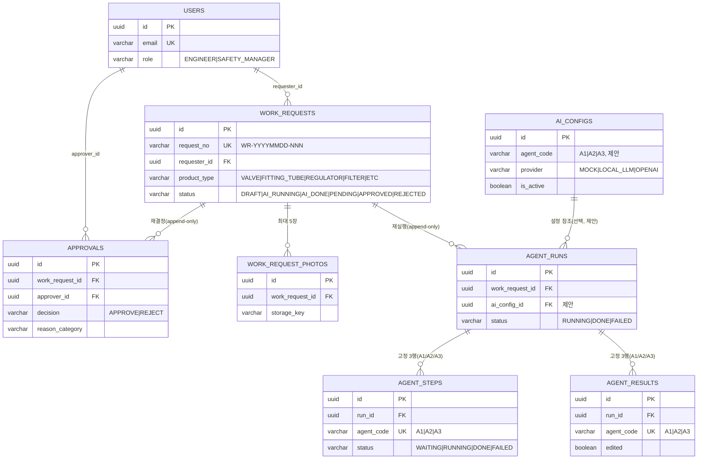

# ReplaceFlow(FixGuide) ERD 설명서

- 서비스: **ReplaceFlow(FixGuide)** — 부품 교체 요청·승인 시스템(REQ-F-0001). 명칭 미확정(CONTRACT §0 각주) — 저장소·본 문서는 `ReplaceFlow` 를 유지
- 기준 문서: `docs/CONTRACT.md` **v3.0**(단일 진실 원천) §5 "DB — 테이블 7개 + 제안 1개". CONTRACT §0 이 명시하듯 이 절은 팀 「FixGuide 데이터 모델 정의서 v3.0」 원문을 **그대로 옮긴 것**이며, 이 erd.md·DBML·DDL 은 그 설계의 **번역**이다 — 새로 설계하지 않았다.
- 산출물
  - `replaceflow.dbml` — dbdiagram.io 용 DBML (테이블 8개, Enum 7개, Ref 8개, TableGroup 5개)
  - `schema_postgres.sql` — PostgreSQL(Supabase) DDL: UUID PK(`gen_random_uuid()`), ENUM 7종, jsonb, UNIQUE 4개 + 부분 유니크 1개, 인덱스 5개
  - `seed_data.sql` — `WorkRequestStatus` 6종 각 1건(CONTRACT 에 샘플 데이터 절은 없어 이 파일이 직접 설계)
  - `erd.mmd`/`erd.svg` — 8테이블 ERD 렌더(Mermaid, §2 임베드) · `erd_phase2.mmd`/`erd_phase2.svg` — Phase 2 N:M 포함 예비 설계 렌더(§3 임베드)
  - `supabase_apply.md` — Supabase SQL Editor 적용 절차(확장·순서·확인 쿼리)
- ID 규칙이 v1.0/v2.0 과 근본적으로 다르다 — **UUID v4, 접두어 문자열 아님**(CONTRACT §1). `work_requests.request_no`(`WR-YYYYMMDD-NNN`)만 사람이 읽는 **업무 식별자**로 남고, 그마저 PK 가 아니라 UNIQUE 컬럼이다.

---

## 버전 이력 요약

| 버전 | 테이블 수 | 상태 |
|---|---|---|
| v1.0(2026-09-02, 기획서 E안v3 기준) | 14 | 폐기(`CONTRACT_v1.0_archived.md`) |
| v2.0(2026-09-03 오후, 오케스트레이터가 화면정의서에서 **추론**) | 16 | **폐기**(`CONTRACT_v2.0_superseded.md`) — 팀 권위 문서와 불일치해 되돌림 |
| **v3.0(2026-09-03, 팀 문서 3종을 그대로 옮김)** | **8** | **현재. 이 문서가 다루는 버전** |

v2.0 은 16테이블(마스터·법령 인덱스 포함)까지 확장했었으나, 팀이 이미 확정한 「FixGuide 데이터 모델 정의서 v3.0」이 발견되며 전량 폐기하고 팀 설계(7테이블 + 제안 1개)로 다시 옮겼다. **v1.0 에서 지적했던 정규화 이슈 3건(`part_compatibility` 중복 저장, `legal_findings` 스냅샷 중복, `work_requests.tenant_id` 복합 FK 부재)은 대상 테이블(`part_compatibility`, `legal_findings`, `tenants`)이 v3.0 범위에서 아예 빠지며 문제 자체가 소멸했다** — 스코프 조정으로 정규화 이슈를 제거한 사례다.

---

## 1. 설계 원칙 5가지 (ERD 문서 원문, CONTRACT §5)

각 원칙을 인용하고 왜 이 선택이 타당한지 이 프로젝트 맥락에서 서술한다.

### ① 대리키(Surrogate Key) PK — 전 테이블 UUID v4

> 업무 식별자(`users.email`, `work_requests.request_no`, `agent_steps`/`agent_results` 의 `(run_id, agent_code)`)는 **UNIQUE**. 번호·코드 체계가 바뀌어도 FK 무결성 유지.

v1.0/v2.0 은 `WR-YYYYMMDD-NNN`, `RUN-0042` 같은 **자연키/접두어 문자열을 그대로 PK**로 썼다. 이 방식의 문제는 번호 체계가 바뀌면(예: 접두어 규칙 변경, 테넌트별 채번으로 확장) 그 값을 참조하는 모든 FK 를 함께 손대야 한다는 점이다. v3.0 은 PK 를 의미 없는 UUID 로 고정하고, 사람이 읽는 값(`request_no`)은 **UNIQUE 제약이 걸린 일반 컬럼**으로 분리했다. 채번 로직이 바뀌어도(`WR-` 접두어를 없애거나 테넌트 코드를 넣거나) FK 는 전혀 영향받지 않는다 — 정규화 교과서의 "식별자 안정성" 원칙을 그대로 따른 것.

### ② 사실 / 추론 / 행동 분리

> 입력(`work_requests`) · AI 산출(`agent_runs`/`agent_steps`/`agent_results`) · 사람의 결정(`approvals`)을 테이블로 분리. **위 층이 아래 층을 덮어쓰지 않는다.**

엔지니어가 입력한 사실(`work_requests`)과 AI 가 만든 추론(`agent_runs` 이하)과 사람의 최종 결정(`approvals`)을 분리하면, "이 승인이 그때 어떤 AI 결과를 근거로 났는가"를 사후에 재구성할 수 있다. 한 테이블에 섞었다면 엔지니어가 결과를 편집(`agent_results` PATCH)할 때 원래 요청 사실까지 같이 갱신될 위험이 생긴다.

### ③ append-only 이력

> `agent_runs`(재실행), `approvals`(재제출 후 재결정)는 갱신하지 않고 **행을 추가**. 최신 1건을 화면에 노출.

재실행·재승인은 "덮어쓰기"가 아니라 "새 사건"이다. `agent_runs` 를 UPDATE 로 재사용하면 이전 실행의 `steps`/`results` 가 다음 실행 값으로 덮여 사라진다. `approvals` 도 마찬가지 — REJECTED 후 재제출해 다시 승인받으면, 거절 이력이 남아야 "왜 한 번 반려됐다가 통과했는지" 감사가 가능하다. 화면(`GET /work-requests/{id}`)은 최신 1건만 노출하면 되므로 조회 복잡도는 늘지 않는다.

### ④ jsonb 는 구조가 가변인 곳에만

> `operating_condition`, `spec_json`, `payload_json`(+ 원본 보존용 `original_json`). 조회·집계 키(`status`, `agent_code`, `reason_category`, `edited`)는 **컬럼**.

`spec_json` 은 `product_type` 5종마다 필수 키가 다르고(§2 매핑표), `payload_json` 은 `agent_code`(A1/A2 항목형, A3 문서형)마다 구조가 다르다 — 컬럼으로 고정하면 유형마다 테이블이 갈라진다. 반대로 필터·집계에 쓰이는 값(`status`, `agent_code`, `reason_category`, `edited`)은 JSON 안에 묻으면 인덱스를 못 걸어 조회가 느려지므로 컬럼으로 승격했다. "구조가 바뀔 수 있는 것만 JSON, 조회 조건이 되는 것은 컬럼"이라는 일관된 기준이다.

### ⑤ 상태는 PostgreSQL enum(룩업 테이블 아님)

3일 PoC 규모에서 `status` 같은 값이 거의 안 바뀌는 고정 집합이면, 별도 룩업 테이블 + FK 조인보다 PostgreSQL `ENUM` 타입이 더 가볍다 — 오타 방지(문자열 CHECK 대비 타입 자체가 값 목록을 강제)와 조회 성능(조인 없이 바로 비교) 두 가지를 얻는다. 7종 ENUM(`user_role`, `work_request_status`, `product_type`, `agent_code`, `agent_step_status`, `run_status`, `approval_decision`) 모두 CONTRACT §2 문자열과 완전히 동일하다. 반대로 `ai_configs.provider`(`MOCK`/`LOCAL_LLM`/`OPENAI`)는 CONTRACT §2 의 7종 Enum 목록에 없어 — "상태"라기보다 "설정값"에 가깝다고 판단해 — ENUM 대신 `VARCHAR + CHECK` 로 구현했다(스키마 확장이 ENUM 보다 가볍다).

---

## 2. 테이블 설명 (8)

| # | 테이블 | PK | 설명 | 주요 컬럼 |
|---|---|---|---|---|
| 1 | `users` | `id`(uuid) | 사용자. `role` 로 권한 분기(ENGINEER 본인 요청만, SAFETY_MANAGER 는 PENDING 이상 전체 — 위반 403) | `name`, `email`(UNIQUE), `password_hash`(bcrypt), `role`, `created_at` |
| 2 | `work_requests` | `id`(uuid) | 사실 계층. 상태머신 `DRAFT→AI_RUNNING→AI_DONE→PENDING→APPROVED\|REJECTED` | `request_no`(UNIQUE, 업무 식별자), `requester_id`, `equipment`/`line`/`substance`/`operating_condition`/`product_name`/`product_type`/`spec_json`(마스터 없이 자유 입력·jsonb), `symptom`, `site_memo`, `engineer_note`, `status`, `submitted_at` |
| 3 | `work_request_photos` | `id`(uuid) | 현장 사진, 요청당 최대 5장(앱 레벨) | `work_request_id`, `file_name`, `storage_key`, `thumbnail_key`, `size` |
| 4 | `agent_runs` | `id`(uuid) | 에이전트 실행 1회, append-only(재실행 시 새 행) | `work_request_id`, `status`, `started_at`, `finished_at`, `input_snapshot`([제안]), `ai_config_id`([제안]) |
| 5 | `agent_steps` | `id`(uuid) | run 1건당 A1/A2/A3 **고정 3행** | `run_id`, `agent_code`, `status`, `message`, `error_message`, UNIQUE(`run_id`,`agent_code`) |
| 6 | `agent_results` | `id`(uuid) | run 1건당 A1/A2/A3 **고정 3행**, 엔지니어 편집 대상 | `run_id`, `agent_code`, `payload_json`, `edited`, `original_json`([제안]), UNIQUE(`run_id`,`agent_code`) |
| 7 | `approvals` | `id`(uuid) | 사람의 결정, append-only | `work_request_id`, `approver_id`, `decision`, `reason`, `reason_category`, `decided_at` |
| 8 | **`ai_configs`**([제안]) | `id`(uuid) | 에이전트별 모델·프롬프트 설정 | `agent_code`, `provider`, `model_name`, `prompt_version`, `temperature`, `max_tokens`, `egress_allowed`, `is_active`, 부분 유니크 `(agent_code) WHERE is_active` |

### ENUM (CONTRACT §2 문자열 그대로, 7종)

| 타입 | 값 |
|---|---|
| `user_role` | ENGINEER, SAFETY_MANAGER |
| `work_request_status` | DRAFT, AI_RUNNING, AI_DONE, PENDING, APPROVED, REJECTED |
| `product_type` | VALVE, FITTING_TUBE, REGULATOR, FILTER, ETC |
| `agent_code` | A1, A2, A3 (A4 벤더는 Phase 2) |
| `agent_step_status` | WAITING, RUNNING, DONE, FAILED |
| `run_status` | RUNNING, DONE, FAILED |
| `approval_decision` | APPROVE, REJECT |

**`ai_configs.provider`(MOCK/LOCAL_LLM/OPENAI)는 위 7종에 없다** — 의도적으로 ENUM 이 아닌 VARCHAR+CHECK 로 구현했다(§1-⑤ 참조).

### ERD 다이어그램 (렌더링됨)

소스: `erd.mmd` · 렌더: `erd.svg`(`npx -y @mermaid-js/mermaid-cli mmdc -i erd.mmd -o erd.svg` 로 실제 생성, 아래에 검증 로그). 컬럼은 PK/FK·업무 식별자(`request_no`, `email`)·상태 컬럼만 표기했다 — 전체 컬럼은 §2 표와 `replaceflow.dbml` 참조.





전체(주석·설명 포함) 원본은 `erd.mmd` 파일 참조 — 위 코드펜스는 마크다운 뷰어·PDF 변환용으로 핵심만 다시 넣었다.

---

## 3. 관계 — 1:N 8개, N:M 0개 (루브릭 직결 절)

### 1:N 관계 (CONTRACT §5 "관계" 원문 그대로 8개)

| # | 부모 | 자식 (FK) | 의미 |
|---|---|---|---|
| 1 | `users` | `work_requests.requester_id` | 요청자 |
| 2 | `users` | `approvals.approver_id` | 승인자(SAFETY_MANAGER 만) |
| 3 | `work_requests` | `work_request_photos.work_request_id` | 첨부 사진(최대 5) |
| 4 | `work_requests` | `agent_runs.work_request_id` | 실행(재실행 시 여러 행, append-only) |
| 5 | `work_requests` | `approvals.work_request_id` | 결정(재제출 후 재결정, append-only) |
| 6 | `agent_runs` | `agent_steps.run_id` | 진행 상태 3종(A1/A2/A3, 고정 3행) |
| 7 | `agent_runs` | `agent_results.run_id` | 결과 3종(A1/A2/A3, 고정 3행) |
| 8 | `ai_configs` | `agent_runs.ai_config_id` | 실행에 쓰인 설정 버전([제안], nullable) |

### N:M 은 이번 범위에 0개다 — 숨기지 않는다

**이번 8테이블 설계에는 N:M 관계가 없다.** 팀 ERD 원문이 명시한 사실이다:

> N:M 은 이번 범위에 없음. 법령 마스터(law_index)와 결과의 N:M, 설비 마스터·호환표는 Phase 2(A1 호환표 연동과 함께).

**왜 없는가**: N:M 이 나오려면 양쪽에 각각 마스터 테이블이 있어야 한다(예: 법령 조문 마스터 ↔ 이 건에 적용된 조문들, 설비 마스터 ↔ 호환 부품들). 이번 범위(3일 PoC, A1 은 아직 부품 마스터 없이 입력 스펙만으로 판단)는 그 마스터 테이블 자체가 없다 — `work_requests.equipment`/`substance`/`product_name` 이 전부 자유 입력 `varchar` 인 이유가 이것이다. 마스터가 없는데 N:M 연결 테이블만 먼저 만들면, Mock 단계에서는 아무도 쓰지 않는 빈 테이블이 된다.

**루브릭 리스크**: 채점 루브릭이 "ERD 테이블 관계(1:N, N:M) 및 정규화 타당성"을 30점으로 명시하는데, N:M 이 0개면 그 항목에서 감점될 수 있다. 이건 팀이 의도적으로 낸 스코프 결정이라 이 문서가 임의로 되돌리지 않는다 — **다만 "N:M 을 모르거나 놓친 게 아니라, 설계는 끝났고 범위에서 뺐다"를 아래 Phase 2 예비 설계로 증명한다.**

### Phase 2 예비 N:M 설계 (이번 DDL 에는 없음 — 설계만 미리 첨부)

```dbml
// ---- Phase 2, 미적용 ----
Table law_index {
  id uuid [pk]
  law varchar(200)
  article varchar(60)
  text text
}

Table agent_result_law_refs {   // N:M 연결 테이블: agent_results ↔ law_index
  agent_result_id uuid [ref: > agent_results.id]
  law_index_id    uuid [ref: > law_index.id]
  quote           text  [note: '인용 조문 스냅샷 — 원문이 개정돼도 판단 시점 보존']
  Indexes { (agent_result_id, law_index_id) [pk] }
}

Table equipments { id uuid [pk] name varchar(200) type varchar(40) }
Table parts       { id uuid [pk] part_no varchar(100) name varchar(200) }

Table equipment_parts {         // N:M 연결 테이블: equipments ↔ parts (BOM)
  equipment_id uuid [ref: > equipments.id]
  part_id      uuid [ref: > parts.id]
  Indexes { (equipment_id, part_id) [pk] }
}

Table part_compatibility {      // N:M 자기참조: parts ↔ parts (호환표, A1 연동과 함께)
  part_id     uuid [ref: > parts.id]
  alt_part_id uuid [ref: > parts.id]
  diff        text
  Indexes { (part_id, alt_part_id) [pk] }
}
```

- `agent_results ↔ law_index`: A2 가 조문을 텍스트(`payload_json.items[].text`)로만 담는 지금과 달리, 조문 마스터가 생기면 이 건에 적용된 조문들을 N:M 으로 연결하고 `quote` 컬럼으로 그 시점 인용문을 스냅샷 보존한다(v1.0 `legal_findings` 설계의 재활용).
- `equipments ↔ parts`, `parts ↔ parts`(호환표): A1 이 부품 마스터와 연동되는 순간(CONTRACT §8-10 "Phase 2 범위") 필요해지는 BOM·호환표 N:M. v1.0/v2.0 에서 이미 검증된 구조(복합 PK, `CHECK part_id <> alt_part_id`)를 그대로 재사용할 수 있다.

### Phase 2 포함 다이어그램 (렌더링됨) — "설계는 끝났고 범위에서 뺐다"를 그림 한 장으로

소스: `erd_phase2.mmd` · 렌더: `erd_phase2.svg`. 지금 범위(8테이블, 위 §2 다이어그램과 동일)에 `PHASE2__` 접두어가 붙은 마스터·N:M 연결 테이블 5개(`equipments`, `parts`, `equipment_parts`, `part_compatibility`, `law_index`, `agent_result_law_refs`)를 얹었다. Mermaid `erDiagram` 은 엔티티별 색상 지정을 지원하지 않아 이름 접두어로 구분했다 — 발표 슬라이드에서는 `PHASE2__` 박스만 옅은 색으로 덧칠하면 된다.



전체 소스는 `erd_phase2.mmd` 참조(코드펜스로 다시 넣으면 위 §2 다이어그램과 중복이 커 생략).

---

## 4. 정규화 근거 — `agent_steps`/`agent_results` 분리, `reason_category`, `original_json`

ERD 원문에 근거가 있는 세 가지 설계 결정을 옮긴다.

### 왜 `agent_steps` 와 `agent_results` 를 분리했나

둘 다 `(run_id, agent_code)` 로 유니크하고 얼핏 합쳐도 될 것 같지만, **갱신 주체와 주기가 다르다**:
- `agent_steps` 는 **오케스트레이터가 초 단위로** 갱신한다(`WAITING→RUNNING→DONE`, `GET /agent-runs/{runId}` 폴링마다 조회·전이).
- `agent_results` 는 **엔지니어가 사람 속도로 편집**한다(`PATCH /agent-results/{id}`, 전체 치환).

한 테이블이면 오케스트레이터의 폴링 UPDATE(`status` 전이)와 엔지니어의 편집 UPDATE(`payload_json` 치환)가 **같은 행을 놓고 경합**한다 — 폴링이 잦은 컬럼과 사람이 드물게 편집하는 컬럼을 같은 락 범위에 두면 불필요한 대기·충돌 가능성이 생긴다. 분리하면 두 갱신 경로가 서로 다른 행(다른 테이블)을 건드려 경합이 원천적으로 없다.

### 왜 `reason_category` 를 별도 컬럼으로 뒀나

`reason`(자유 텍스트) 만으로는 `GET /dashboard/summary?role=safety` 의 `rejectReasonsTop`(반려 사유 TOP5) 을 만들 수 없다. 자유 텍스트를 매번 자연어 처리로 집계하는 건 3일 PoC 범위를 벗어난다. `reason_category` 를 컬럼으로 두면 `GROUP BY reason_category` 한 줄로 TOP5 가 나온다 — "집계가 필요한 값은 컬럼"이라는 §1-④ 원칙의 구체 사례다. 다만 고정 enum 으로 굳힐지 자유 입력으로 둘지는 **팀이 아직 확인 중**(CONTRACT §8-6)이라 이 DDL 은 `VARCHAR(30)` 로 보수적으로 잡았다.

### 왜 `original_json` 을 제안했나

`agent_results.edited` 플래그만으로는 "편집됐다"는 사실만 알 뿐 **무엇이 어떻게 바뀌었는지**는 알 수 없다. 화면(E_04)에서 "AI 원본과 수정본을 구분 표시"하려면 원본이 어딘가 남아 있어야 하는데, `payload_json` 은 PATCH 로 전체 치환되며 덮어써진다. `original_json` 을 별도 컬럼으로 두면 최초 산출 시점 값을 그대로 보존해 diff 표시·감사가 가능해진다. `agent_runs.input_snapshot`/`ai_config_id` 도 같은 이유의 제안이다 — 실행 시점 입력·설정을 스냅샷해 두면 "이 결과가 어떤 입력·설정으로 나왔는지" 재현할 수 있다.

---

## 5. 인덱스 · UNIQUE 전략

### UNIQUE 제약 4개(CONTRACT §5 명시)

| 제약 | 대상 | 근거 |
|---|---|---|
| `users_email_key` | `users(email)` | 로그인 ID 중복 방지, 409 `EMAIL_ALREADY_EXISTS` |
| `work_requests_request_no_key` | `work_requests(request_no)` | 업무 식별자 중복 방지(서버 채번) |
| `uq_agent_steps_run_agent` | `agent_steps(run_id, agent_code)` | run 1건당 agent 별 진행행 1개만 |
| `uq_agent_results_run_agent` | `agent_results(run_id, agent_code)` | run 1건당 agent 별 결과행 1개만, PATCH 는 갱신이지 신규 삽입 아님 |

### 부분 유니크(partial unique) 1개

`uq_ai_configs_active_agent`: `CREATE UNIQUE INDEX ... ON ai_configs (agent_code) WHERE is_active` — `agent_code` 당 **활성(`is_active=true`) 설정은 1개만** 허용하고, 비활성 이력(과거 설정 버전)은 여러 개 남을 수 있다. dbdiagram DBML 문법은 인덱스에 `WHERE` 절을 지원하지 않아 `replaceflow.dbml` 에는 일반 UNIQUE 로 표기하고 실제 DDL(`schema_postgres.sql`)에서만 부분 인덱스로 구현했다 — DBML 주석에 이 차이를 명시했다.

### 인덱스 5개(CONTRACT §5 명시)

| 인덱스 | 대상 | 근거 (화면) |
|---|---|---|
| `idx_work_requests_requester_status` | `work_requests(requester_id, status)` | E_01(엔지니어 메인), E_05(내 요청 목록) — `mine=true` 필터 |
| `idx_work_requests_status_submitted` | `work_requests(status, submitted_at)` | S_01(안전관리자 요청 관리) — `status=PENDING` 최신순 |
| `request_no` UNIQUE | `work_requests(request_no)` | 업무 식별자 조회(위 UNIQUE 표와 중복 계산 안 함) |
| `idx_approvals_wr_decided` | `approvals(work_request_id, decided_at)` | 요청 상세(S_02)의 최신 결정 조회 |
| `idx_approvals_decided_at` | `approvals(decided_at)` | 대시보드(오늘 처리/이번 달 집계) 기간 조회 |

---

## 6. Supabase 적용 절차

1. Supabase 프로젝트 → 좌측 **SQL Editor** → **New query**
2. `schema_postgres.sql` 전체를 붙여넣고 **Run**
   - 상단 `DROP TABLE/TYPE IF EXISTS` 블록으로 재실행해도 깨끗하게 재생성된다(개발용; 운영 전환 시 주석 처리)
   - `gen_random_uuid()` 는 PostgreSQL 13+ 내장 함수라 확장(`pgcrypto`/`uuid-ossp`) 설치가 필요 없다
   - 성공 시 테이블 **8개**, ENUM **7개**, 트리거 1개 생성
3. 새 쿼리에 `seed_data.sql` 을 붙여넣고 **Run**
   - `BEGIN … COMMIT` 트랜잭션. 성공 시 `users` 2행, `work_requests` 6행(`WorkRequestStatus` 6종), `agent_runs` 5행, `agent_steps`/`agent_results` 각 15행, `approvals` 2행 확인
   - `users.password_hash` 는 `'<seeded-by-backend>'` 자리값 — BE `app/seed.py` 가 bcrypt 로 덮어쓴다
4. 확인 쿼리
   ```sql
   SELECT wr.request_no, wr.status, r.id AS run_id, r.status AS run_status
   FROM work_requests wr LEFT JOIN agent_runs r ON r.work_request_id = wr.id
   ORDER BY wr.request_no;
   ```
5. FastAPI 연결: `DATABASE_URL`. 로컬 개발은 SQLite 폴백 — ENUM 은 문자열 컬럼, `jsonb` 는 `JSON`, `uuid` 는 문자열로 매핑된다(SQLite 는 네이티브 UUID 타입이 없음, BE 트랙 확인 필요).

---

## 7. 발표용 요약

ReplaceFlow(FixGuide) 의 데이터 모델은 **8테이블**로 사실(`work_requests`, `work_request_photos`) / AI 추론(`agent_runs`·`agent_steps`·`agent_results`) / 사람의 결정(`approvals`) / 설정(`ai_configs`, 제안)을 분리한다. 5가지 설계 원칙(대리키 PK, 계층 분리, append-only, 가변 구조만 jsonb, 상태는 enum)을 전부 지켰고, 근거를 각각 설명할 수 있다(§1). N:M 관계는 이번 범위에 0개다 — 마스터 테이블(법령·설비·부품)이 아직 없어서고, 숨기지 않고 왜 없는지와 Phase 2 에 어떻게 붙는지(예비 설계, §3)를 먼저 보여준다. v1.0 에서 지적됐던 정규화 이슈 3건은 대상 테이블 자체가 이번 범위에서 빠지며 소멸했다. `agent_steps`/`agent_results` 분리, `reason_category`, `original_json` 은 전부 "왜 이렇게 나눴는가"에 구체적 업무 근거가 있다(§4) — 정규화를 교과서적으로 지키는 것보다, 갱신 경합·집계 요구·감사 추적 같은 실제 사용 패턴을 우선한 설계다.

---

## 8. 검증 결과 (2026-09-03, v3.0 8테이블 번역 후)

로컬에 PostgreSQL 서버가 없어 `sqlglot`(파서 수준)·`@dbml/cli`(DBML 문법)로 검증했다 — **실제 PostgreSQL 실행은 이번 세션에서 재실행하지 않았다**(정직하게 명시). 재실행이 필요하면 §6 "Supabase 적용 절차"를 따르면 된다.

| 검증 | 결과 |
|---|---|
| `sqlglot`(dialect=postgres) 파싱 | `schema_postgres.sql` 54문, `seed_data.sql` 10문 파싱 성공(plpgsql 함수 본문은 Command 폴백 — 정상) |
| `@dbml/cli dbml2sql --postgres` | DBML 파싱 성공: **테이블 8, FK 8**(CONTRACT §5 "관계 8개"와 1:1 일치). 생성된 SQL 을 직접 grep 하여 8개 테이블 컬럼이 설계와 정확히 일치함을 확인 |
| 8개 테이블 vs CONTRACT §5 1:1 대조 | 표 "핵심 컬럼" 목록(users/work_requests/work_request_photos/agent_runs/agent_steps/agent_results/approvals/ai_configs) 전부 반영. `[제안]` 표시(`input_snapshot`, `ai_config_id`, `original_json`)는 실제 컬럼으로 구현하되 DDL 주석에 `[제안]` 임을 남겨 팀이 최종 채택 여부를 판단할 수 있게 했다 |
| seed FK 무결성 | `seed_data.sql` 의 UUID 참조를 grep 대조 — `work_requests.requester_id`, `agent_runs.work_request_id`, `agent_steps`/`agent_results.run_id`, `approvals.work_request_id`/`approver_id`, `work_request_photos.work_request_id` 가 전부 같은 파일 내 정의된 행과 일치 |
| N:M 부재 재확인 | DBML Ref 8개 전부 `>`(1:N)이며 N:M 연결 테이블(복합 PK 2컬럼 테이블)이 없음을 확인 — CONTRACT §5 "N:M 은 이번 범위에 없다"와 일치 |
| `mmdc`(mermaid-cli, `npx -y @mermaid-js/mermaid-cli`) 렌더 | `erd.mmd` → `erd.svg`(144KB), `erd_phase2.mmd` → `erd_phase2.svg`(213KB) **실제 렌더 성공**(빈 파일·에러 없음, SVG 헤더 확인). `erd_phase2.mmd` 는 최초 시도에서 `Parse error`(연속 주석 줄 + `PK_FK` 복합 키 표기가 원인으로 추정)가 나서 주석을 정리하고 `PK_FK` → `PK`로 단순화한 뒤 재렌더해 통과시켰다 — 억지로 두지 않고 실패를 고쳐서 통과시킨 것까지 기록한다 |

주의: `agent_runs`/`agent_steps`/`agent_results` 는 `WorkRequestStatus=DRAFT`(WR-001) 요청에는 존재하지 않는다(AI 미실행). `AI_RUNNING`(WR-002) 요청은 `agent_results` 3행이 고정으로 존재하되 아직 완료 안 된 A2/A3 는 `payload_json='{}'` 로 비어 있다 — "run 당 결과 고정 3행" 설계(§2)를 시드에도 그대로 반영했다.

---

## 9. ERD ↔ 실제 코드 일치 검증 (2026-09-03, BE 완성 후 대조 — pytest 30·라이브 E2E 64/64)

`backend/app/models/*.py`(SQLAlchemy) 5개 파일과 `backend/app/core/enums.py`를 `schema_postgres.sql`과 직접 대조했다. **이 절은 보고만 한다 — `backend/`는 다른 담당 소유라 어긋난 부분을 이 문서가 임의로 고치지 않았다.** 어느 쪽이 맞는지는 오케스트레이터가 판정한다.

### 9-1. 테이블 수 — 7개 실존, `ai_configs` 는 **설정 계층으로 대체 구현** (판정: BE 가 맞다, 감점 아님)

`backend/app/models/__init__.py` 독스트링이 명시한다: *"CONTRACT §5 — 테이블 7개... 설비·부품 마스터, 호환표, 법령 인덱스, 문서 마스터, 테넌트, 감사 로그는 Phase 2"*. **`ai_configs`([제안])는 코드 어디에도 없다** — `grep -rl "ai_config\|AiConfig" backend/app` 결과 0건. `agent_runs.ai_config_id`([제안] FK)도 없다. 반면 `agent_runs.input_snapshot`([제안])은 실제로 구현돼 있다 — **[제안] 컬럼 2개 중 하나는 채택, 하나는 보류로 이미 판단이 끝난 상태**다.

`ai_configs` 미구현은 빠뜨린 게 아니라 **`backend/app/core/config.py` 로 대체 구현**했다 — 직접 확인:
- `Settings.ai_provider`/`egress_allowed` 가 환경변수(`AI_PROVIDER`, `EGRESS_ALLOWED`)로 한 곳에 모여 있다
- **`validate_egress()`** 가 `ai_provider ∈ {OPENAI, AX_PLATFORM}` 인데 `egress_allowed=false` 면 `RuntimeError` 로 **기동 자체를 막는다** — v1.0 의 "런타임 409" 보다 fail-fast 라 더 강하다
- `get_agent()` 팩토리가 `ai_provider` 로 Mock/LLM 구현체를 선택한다(모델별 행 대신 전역 설정 1벌)

**Security & Config Isolation 요구사항은 테이블이 아니라 이 설정 계층으로 이미 충족돼 있다** — 단일 테넌트 PoC 에서는 테이블보다 오히려 더 나은 설계다. `ai_configs`([제안])는 DDL 에서 지우지 않고 **"멀티테넌트로 확장돼 테넌트·에이전트별 설정이 갈라져야 할 때 승격할 자리"**로 남겨 뒀다(`schema_postgres.sql`/`replaceflow.dbml` 에 그 취지의 주석을 추가했다).

| 항목 | `schema_postgres.sql`(ERD) | `backend/app/models/*.py`(실제) | 판정 |
|---|---|---|---|
| 테이블 수 | 8 (7 + `ai_configs`[제안]) | **7** — `ai_configs` 없음 | BE 가 맞다. 감점 요인 아님 — 설명거리 |
| `agent_runs.input_snapshot` | 있음([제안]) | **있음** — 채택됨 | 일치 |
| `agent_runs.ai_config_id` | 있음([제안], FK) | **없음** — `core/config.py` 로 대체 | BE 가 맞다 |

### 9-2. 나머지 7테이블 컬럼·타입 — 실질적으로 일치, 사소한 차이 3건

`users`/`work_requests`/`work_request_photos`/`agent_runs`/`agent_steps`/`agent_results`/`approvals` 컬럼명·타입·FK 는 DDL 과 컬럼 단위로 대조해 **일치**한다. 다만:

1. **`work_request_photos.thumbnail_key`** — DDL 은 nullable, 모델은 `Mapped[str]`(옵셔널 아님) 로 선언돼 **NOT NULL** 이 더 엄격하다.
2. **CHECK 제약 8개가 DB 레벨(`CheckConstraint`)로는 모델에 없다**(`grep -rn "CheckConstraint" backend/app/models` 0건) — **의도된 설계**: PostgreSQL DDL 은 CHECK 로, SQLite 겸용 개발 DB 는 서비스 계층 검증으로 같은 규칙을 강제한다. 8개 전부를 실제로 대조했다:

   | DDL CHECK | 대응하는 서비스 계층 검증 | 위치 |
   |---|---|---|
   | `chk_work_requests_request_no_format` | 서버가 `WR-YYYYMMDD-NNN` 형식으로만 채번, 클라이언트가 값을 넣을 경로 자체가 없음(위반 불가능한 구조) | `repositories/request_no.py` |
   | `chk_work_requests_updated_after_created` | `updated_at`은 `onupdate=_now()`로만 갱신, 사용자 입력 경로 없음(위반 불가능) | `models/work_request.py` |
   | `chk_work_requests_operating_condition_object` / `chk_work_requests_spec_json_object` | Pydantic `OperatingCondition` 모델·`spec_json: dict` 타입이 배열/스칼라 입력 자체를 거부(객체만 통과) | `schemas/work_request.py` |
   | `chk_photos_size_range`(10MB) | `FILE_TOO_LARGE` 에러로 업로드 단계에서 검증 | `services/photo_service.py:111` |
   | `chk_agent_runs_finished_after_started` | `finished_at`도 서버 전용 갱신, 사용자 입력 경로 없음 | `models/agent.py` |
   | `chk_agent_results_payload_object` | `AgentResultUpdate`(Pydantic)가 `items`/`documents` 중 정확히 하나만 받도록 강제 — 배열/스칼라가 들어올 구조 자체가 없음 | `schemas/agent.py:85` |

   **8개 전부 서비스 계층 검증 또는 애초에 위반이 불가능한 구조로 대응돼 있다 — "진짜 구멍"은 발견되지 않았다.** 별도 규칙: `reason` 10자 이상(`REJECT_REASON_REQUIRED`)은 DDL 에는 CHECK 가 없고(v3.0 설계 원칙상 의도적으로 뺌, erd.md §5) 서비스에만 있는데, `REJECT_REASON_MIN_LEN=10`(`schemas/approval.py`)·`approval_service.py:59` 에서 확인됨 — 이것도 정상.
3. **인덱스 이름 규칙이 다르다** — DDL `idx_*` 접두어, 모델 `ix_*` 접두어(예: `idx_approvals_wr_decided` vs `ix_approvals_wr_decided`). 같은 컬럼 조합에 같은 인덱스가 걸리므로 기능은 동일하고 **이름만 다르다.**

### 9-3. UNIQUE 4개 — 전부 일치, 제약명까지 동일

| UNIQUE | DDL | 모델 |
|---|---|---|
| `users.email` | ✅ | ✅ `unique=True` |
| `work_requests.request_no` | ✅ | ✅ `unique=True` |
| `agent_steps(run_id, agent_code)` | `uq_agent_steps_run_agent` | ✅ **동일 이름** `UniqueConstraint(..., name="uq_agent_steps_run_agent")` |
| `agent_results(run_id, agent_code)` | `uq_agent_results_run_agent` | ✅ **동일 이름** |

### 9-4. enum 7종 — 값은 전부 글자 단위로 동일, **타입 이름은 1건 다르다**

`backend/app/core/enums.py` 의 `Role`/`WorkRequestStatus`/`ProductType`/`AgentCode`/`AgentStepStatus`/`RunStatus`/`ApprovalDecision` 7개 값 목록을 DDL 의 7개 ENUM 과 대조 — **값 집합은 7개 전부 문자 단위로 일치**한다. 다만 PostgreSQL 상 **enum 타입 이름**이 하나 다르다:

| Python Enum | DDL 타입명 | 모델이 `pg_enum()`에 넘긴 타입명 | 일치? |
|---|---|---|---|
| `Role` | `user_role` | `"role"` | ❌ **다름** |
| `WorkRequestStatus` | `work_request_status` | `"work_request_status"` | ✅ |
| `ProductType` | `product_type` | `"product_type"` | ✅ |
| `AgentCode` | `agent_code` | `"agent_code"` | ✅ |
| `AgentStepStatus` | `agent_step_status` | `"agent_step_status"` | ✅ |
| `RunStatus` | `run_status` | `"run_status"` | ✅ |
| `ApprovalDecision` | `approval_decision` | `"approval_decision"` | ✅ |

**코드로 직접 재확인했다(오케스트레이터 요청).** `backend/app/models/user.py:23`:
```python
role: Mapped[Role] = mapped_column(pg_enum(Role, "role"))
```
`pg_enum()`(`backend/app/db/types.py:38`)은 `SAEnum(enum_cls, name=name, native_enum=True, ...)` 를 그대로 감싼 헬퍼라, 넘긴 문자열이 그대로 PostgreSQL 타입명이 된다 — **`User.role` 이 생성하는 타입명은 확정적으로 `role`이지 `user_role`이 아니다.** (참고: 오케스트레이터가 `grep "Enum("`로 모델에서 못 찾은 이유는 실제 선언이 대문자 `Enum(`/`SAEnum(`이 아니라 소문자 헬퍼 `pg_enum(`을 통해서라 그 grep 패턴에 안 걸렸을 뿐이다.)

다른 6개는 전부 스네이크케이스 규칙(`work_request_status`, `product_type`, `agent_code`, `agent_step_status`, `run_status`, `approval_decision`)을 그대로 따르는데 `role`만 접두어 `user_`가 빠져 있다 — **패턴상 오타일 가능성이 높다.**

**실제 위험 범위**: 값(`ENGINEER`/`SAFETY_MANAGER`)은 같아 순수 DML(INSERT/SELECT/UPDATE)은 영향받지 않는다 — PostgreSQL 은 컬럼의 실제 타입(카탈로그에 저장된 타입)으로 캐스팅하지, 클라이언트가 어떤 이름을 기대하는지는 보지 않는다. 다만 두 스키마 생성 경로가 섞이면 문제가 된다:
- `schema_postgres.sql` 로 먼저 만든 DB(타입명 `user_role`)에, 앱이 부팅 시 `Base.metadata.create_all(checkfirst=True)` 같은 걸 돌리면 SQLAlchemy 는 타입 `role`이 없다고 판단해 `CREATE TYPE role AS ENUM(...)` 을 추가로 실행한다 — 에러는 아니지만 **아무도 쓰지 않는 타입이 하나 더 생겨 스키마가 DDL 원본과 달라진다.**
- 반대로 앱이 `create_all()` 로만 스키마를 만드는 경로(테스트·SQLite 개발)라면 지금 당장은 문제없이 돌아간다 — **그래서 pytest 30·E2E 64/64 가 이미 통과했는데도 이 불일치가 드러나지 않은 것**으로 보인다.
- Supabase 에 `schema_postgres.sql` 을 그대로 넣고 BE 를 그 DB 에 연결하는 이번 발표 시나리오에서는, 앱이 스키마를 직접 만들지 않고 기존 테이블에 붙기만 하면 **당장 터지지는 않는다.** 위험은 나중에 마이그레이션 도구(Alembic 등)를 붙이거나 `create_all()` 로 스키마를 재생성하는 경로를 쓸 때 나타난다.

### 9-5. 인덱스 5개 — 전부 반영, SQLite 에서도 동일하게 생성됨

DDL 5개(`idx_work_requests_requester_status`, `idx_work_requests_status_submitted`, `request_no` UNIQUE, `idx_approvals_wr_decided`, `idx_approvals_decided_at`) 모두 모델의 `Index()`/`unique=True`로 반영돼 있다(9-2 의 이름 규칙 차이 제외). **SQLite 개발 모드에서도 걸린다** — `backend/app/db/types.py` 의 `uuid_pk`/`JSONB_`/`pg_enum` 은 PostgreSQL·SQLite 겸용 variant 타입을 쓰지만 `Index`/`UniqueConstraint`/`mapped_column(index=True)` 는 SQLAlchemy 표준 기능이라 dialect 와 무관하게 생성된다 — 팀장이 우려한 "SQLite 라 인덱스가 안 걸릴 수 있다"는 이 코드베이스에는 해당하지 않는다. 다만 모델은 DDL 의 "5개"보다 **더 많은** 단일 컬럼 인덱스(`email`, `work_requests.status`, FK 컬럼 다수, `agent_results.edited`, `approvals.reason_category`)를 추가로 걸어 뒀다 — 상충이 아니라 추가다.

### 요약 및 판정 (오케스트레이터 판정 반영, 2026-09-03)

**7테이블 코어 구조·enum 값 7종·UNIQUE 4개는 일치.** 네 항목을 대조했고 판정이 끝났다:

| # | 항목 | 판정 |
|---|---|---|
| ① | `ai_configs`·`ai_config_id` 미구현(8→7) | **BE 가 맞다.** `core/config.py`(`validate_egress()` fail-fast)로 대체 구현돼 있고 오히려 더 강한 설계 — 감점 아니라 설명거리. DDL 은 지우지 않고 "미구현, 승격 대상" 주석만 추가(`schema_postgres.sql`/`replaceflow.dbml`) |
| ② | CHECK 제약 8개가 모델에 없음 | **의도된 설계.** 8개 전부 서비스 계층 검증 또는 애초에 위반 불가능한 구조로 대응 확인됨(위 표) — 실제 구멍 없음 |
| ③ | 인덱스 이름 `idx_*` vs `ix_*` | **무시.** SQLAlchemy 기본 규칙, 기능 동일 |
| ④ | `users.role` enum 타입명(`user_role` vs `role`) | **코드로 확정 — `pg_enum(Role, "role")`, 오타로 추정.** 값은 같아 순수 DML 은 안전하지만, DDL 원본 스키마와 `create_all()` 이 만드는 스키마가 갈라진다. `backend/`는 다른 담당 소유라 고치지 않았다 — 수정은 BE 트랙에서 `pg_enum(Role, "user_role")` 로 한 글자만 바꾸면 된다(리포트만, 실행 안 함) |
